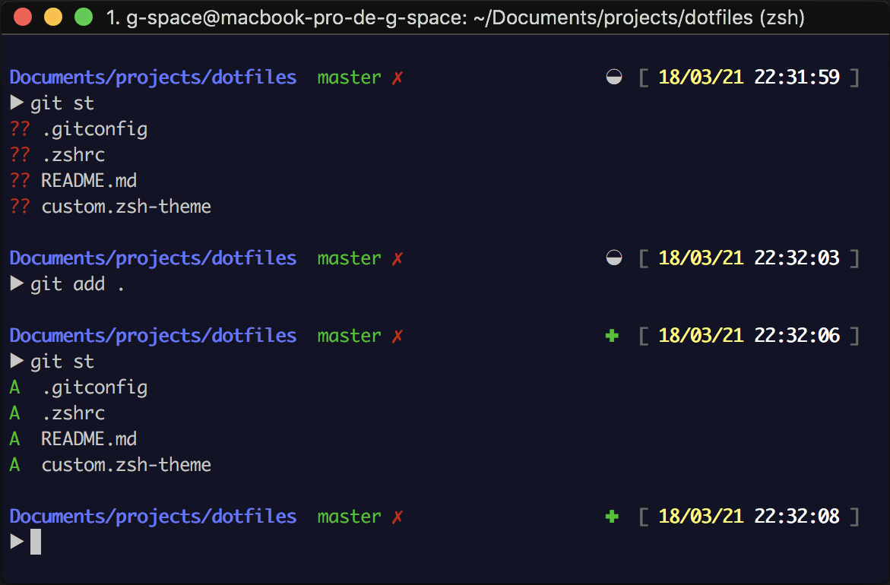

# My Dot files

* .gitconfig from [dlecan/dotfiles](https://github.com/dlecan/dotfiles)
* .zshrc 
* zsh-theme from [robbyrussell/oh-my-zsh/avit](https://github.com/robbyrussell/oh-my-zsh/wiki/themes#avit)
    

